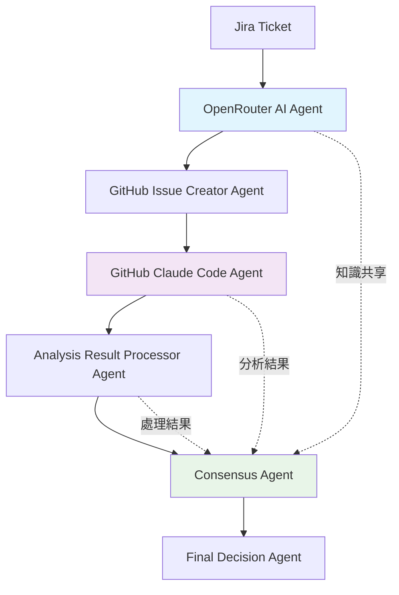

# GitHub Claude Code 與 OpenRouter AI 協作分析機制

## 🔍 現有機制分析

### 當前流程

1. **Jira Ticket** → **OpenRouter AI 團隊匹配** → **GitHub Issue 創建**
2. **GitHub Issue** → **Claude Code 分析** → **結果回傳** → **評分聚合**

### 問題識別

- OpenRouter AI 和 GitHub Claude Code 各自獨立工作
- 缺乏協作和知識共享機制
- 沒有利用兩個 AI 的互補優勢

## 🚀 多智能體協作設計

### 協作架構圖



### 1. 增強型 OpenRouter AI Agent

```typescript
// 增強型 OpenRouter AI 代理
class EnhancedOpenRouterAgent extends BaseAgent {
  name = 'EnhancedOpenRouterAgent';
  description = '負責初步分析和後續協作分析';
  capabilities = [
    'initial-analysis',
    'collaborative-analysis',
    'knowledge-sharing',
  ];

  constructor(private openRouterService: OpenRouterService) {
    super();
  }

  async process(input: AgentMessage): Promise<AgentMessage> {
    const { ticketSummary, ticketDescription, teamMapping, phase } =
      input.payload;

    switch (phase) {
      case 'initial':
        return await this.performInitialAnalysis(
          ticketSummary,
          ticketDescription,
          teamMapping,
        );
      case 'collaborative':
        return await this.performCollaborativeAnalysis(input.payload);
      case 'consensus':
        return await this.participateInConsensus(input.payload);
      default:
        throw new Error(`Unsupported phase: ${phase}`);
    }
  }

  private async performInitialAnalysis(
    ticketSummary: string,
    ticketDescription: string,
    teamMapping: any[],
  ): Promise<AgentMessage> {
    // 原有的團隊匹配分析
    const result = await this.openRouterService.analyzeTeamMatch(
      ticketSummary,
      ticketDescription,
      teamMapping,
    );

    // 添加協作上下文
    const enhancedResult = {
      ...result,
      analysisContext: {
        agent: this.name,
        timestamp: new Date(),
        confidence: this.calculateConfidence(result),
        reasoning: this.extractReasoning(result),
        suggestedCollaboration: this.suggestCollaboration(result),
      },
    };

    return {
      id: uuidv4(),
      from: this.name,
      to: 'GitHubIssueCreatorAgent',
      type: 'delegation',
      payload: {
        analysisResult: enhancedResult,
        nextPhase: 'github-analysis',
      },
      timestamp: new Date(),
      correlationId: input.correlationId,
    };
  }

  private async performCollaborativeAnalysis(
    payload: any,
  ): Promise<AgentMessage> {
    const { githubAnalysis, originalAnalysis } = payload;

    // 基於 GitHub Claude Code 的分析結果進行協作分析
    const collaborativePrompt = this.buildCollaborativePrompt(
      originalAnalysis,
      githubAnalysis,
    );

    const response =
      await this.openRouterService.callOpenRouterAPI(collaborativePrompt);
    const collaborativeResult = this.parseCollaborativeResponse(response);

    return {
      id: uuidv4(),
      from: this.name,
      to: 'ConsensusAgent',
      type: 'delegation',
      payload: {
        originalAnalysis,
        githubAnalysis,
        collaborativeAnalysis: collaborativeResult,
      },
      timestamp: new Date(),
      correlationId: input.correlationId,
    };
  }

  private buildCollaborativePrompt(
    originalAnalysis: any,
    githubAnalysis: any,
  ): string {
    return `你是一個協作分析專家。請基於以下兩個分析結果進行協作分析：

## OpenRouter AI 分析結果
${JSON.stringify(originalAnalysis, null, 2)}

## GitHub Claude Code 分析結果
${JSON.stringify(githubAnalysis, null, 2)}

## 協作分析要求
1. 比較兩個分析的異同點
2. 識別互補的信息
3. 提供綜合評估
4. 建議最終決策

請以 JSON 格式返回協作分析結果：
\`\`\`json
{
  "comparison": {
    "similarities": ["共同點1", "共同點2"],
    "differences": ["差異點1", "差異點2"]
  },
  "complementaryInfo": {
    "openrouterInsights": ["OpenRouter獨有見解"],
    "githubInsights": ["GitHub Claude獨有見解"]
  },
  "synthesis": {
    "finalScore": 85,
    "confidence": 0.9,
    "reasoning": "綜合分析推理...",
    "recommendations": ["建議1", "建議2"]
  }
}
\`\`\``;
  }
}
```

### 2. GitHub Issue Creator Agent

```typescript
// GitHub Issue 創建代理
class GitHubIssueCreatorAgent extends BaseAgent {
  name = 'GitHubIssueCreatorAgent';
  description = '負責創建 GitHub Issue 並協調分析流程';
  capabilities = ['issue-creation', 'workflow-coordination'];

  constructor(private githubService: GitHubService) {
    super();
  }

  async process(input: AgentMessage): Promise<AgentMessage> {
    const { analysisResult, nextPhase } = input.payload;

    // 創建 GitHub Issue
    const issue = await this.createCollaborativeIssue(analysisResult);

    // 設置協作上下文
    const collaborationContext = {
      issueUrl: issue.html_url,
      issueNumber: issue.number,
      openrouterAnalysis: analysisResult,
      expectedGitHubAnalysis: this.generateExpectedAnalysis(analysisResult),
    };

    return {
      id: uuidv4(),
      from: this.name,
      to: 'GitHubClaudeCodeAgent',
      type: 'delegation',
      payload: {
        issue,
        collaborationContext,
        nextPhase: 'github-analysis',
      },
      timestamp: new Date(),
      correlationId: input.correlationId,
    };
  }

  private async createCollaborativeIssue(analysisResult: any): Promise<any> {
    const issueData = {
      issue: {
        key: `${analysisResult.bestMatch?.team || 'Unknown'}-COLLAB-${Date.now()}`,
        fields: {
          summary: `[協作分析] ${analysisResult.bestMatch?.team || '團隊匹配'} - 多AI協作分析`,
          description: this.buildCollaborativeIssueDescription(analysisResult),
        },
      },
      labels: 'analyze,claude-code,collaborative-ai',
    };

    return await this.githubService.createIssue(
      analysisResult.bestMatch?.owner || 'Positive-LLC',
      analysisResult.bestMatch?.repo || 'ai-agent-dev',
      issueData,
    );
  }

  private buildCollaborativeIssueDescription(analysisResult: any): string {
    return `
## 多AI協作分析任務

### OpenRouter AI 初步分析結果
**最佳匹配團隊**: ${analysisResult.bestMatch?.team || '未確定'}
**匹配分數**: ${analysisResult.bestMatch?.score || 0}/100
**信心度**: ${analysisResult.bestMatch?.confidence || 0}
**推理過程**: ${analysisResult.bestMatch?.reasoning || '無'}

### 協作分析指示
請基於以上 OpenRouter AI 的分析結果，進行以下協作分析：

1. **驗證分析**: 驗證 OpenRouter AI 的團隊匹配是否合理
2. **補充分析**: 提供額外的技術和架構分析
3. **評分對比**: 給出你的評分並與 OpenRouter AI 的評分對比
4. **協作建議**: 提供協作改進建議

### 回覆格式
請在回覆中包含：
1. **驗證結果**: 對 OpenRouter AI 分析的驗證
2. **補充分析**: 額外的技術分析
3. **評分對比**: 你的評分 vs OpenRouter AI 評分
4. **協作建議**: 如何改進協作分析

### 評分標準
請根據以下標準給出 0-100 分的評分：
- 技術可行性 (30分)
- 架構匹配度 (25分)  
- 開發複雜度 (20分)
- 維護成本 (15分)
- 業務價值 (10分)

---
*此 issue 由多AI協作系統自動創建*
    `.trim();
  }
}
```

### 3. GitHub Claude Code Agent

```typescript
// GitHub Claude Code 代理
class GitHubClaudeCodeAgent extends BaseAgent {
  name = 'GitHubClaudeCodeAgent';
  description = '負責處理 GitHub Claude Code 的分析結果';
  capabilities = ['github-analysis-processing', 'claude-code-integration'];

  async process(input: AgentMessage): Promise<AgentMessage> {
    const { issue, collaborationContext, nextPhase } = input.payload;

    // 等待 GitHub Claude Code 完成分析
    const githubAnalysis = await this.waitForGitHubAnalysis(issue);

    // 處理分析結果
    const processedAnalysis = await this.processGitHubAnalysis(
      githubAnalysis,
      collaborationContext,
    );

    return {
      id: uuidv4(),
      from: this.name,
      to: 'EnhancedOpenRouterAgent',
      type: 'delegation',
      payload: {
        githubAnalysis: processedAnalysis,
        originalAnalysis: collaborationContext.openrouterAnalysis,
        nextPhase: 'collaborative',
      },
      timestamp: new Date(),
      correlationId: input.correlationId,
    };
  }

  private async waitForGitHubAnalysis(issue: any): Promise<any> {
    // 輪詢等待 GitHub Claude Code 完成分析
    let attempts = 0;
    const maxAttempts = 30; // 5分鐘超時

    while (attempts < maxAttempts) {
      const updatedIssue = await this.githubService.getIssueByUrl(
        issue.html_url,
      );

      if (this.isAnalysisComplete(updatedIssue)) {
        return this.extractAnalysisFromIssue(updatedIssue);
      }

      await this.sleep(10000); // 等待10秒
      attempts++;
    }

    throw new Error('GitHub Claude Code 分析超時');
  }

  private isAnalysisComplete(issue: any): boolean {
    // 檢查 issue 是否有分析結果
    const body = issue.body || '';
    return body.includes('**評分:**') || body.includes('**評分: **');
  }

  private extractAnalysisFromIssue(issue: any): any {
    const body = issue.body || '';

    // 提取評分
    const scoreMatch = body.match(/\*\*評分:\s*(\d+)\s*分\*\*/);
    const score = scoreMatch ? parseInt(scoreMatch[1]) : 0;

    // 提取分析內容
    const analysisMatch = body.match(/### 回覆格式([\s\S]*?)(?=---|$)/);
    const analysis = analysisMatch ? analysisMatch[1].trim() : '';

    return {
      score,
      analysis,
      issueUrl: issue.html_url,
      issueNumber: issue.number,
      timestamp: new Date(),
    };
  }
}
```

### 4. 共識代理 (Consensus Agent)

```typescript
// 共識代理
class ConsensusAgent extends BaseAgent {
  name = 'ConsensusAgent';
  description = '負責協調多個AI的分析結果並達成共識';
  capabilities = ['consensus-building', 'multi-ai-coordination'];

  async process(input: AgentMessage): Promise<AgentMessage> {
    const { originalAnalysis, githubAnalysis, collaborativeAnalysis } =
      input.payload;

    // 構建共識分析
    const consensus = await this.buildConsensus(
      originalAnalysis,
      githubAnalysis,
      collaborativeAnalysis,
    );

    return {
      id: uuidv4(),
      from: this.name,
      to: 'FinalDecisionAgent',
      type: 'delegation',
      payload: {
        consensus,
        allAnalyses: {
          openrouter: originalAnalysis,
          github: githubAnalysis,
          collaborative: collaborativeAnalysis,
        },
      },
      timestamp: new Date(),
      correlationId: input.correlationId,
    };
  }

  private async buildConsensus(
    originalAnalysis: any,
    githubAnalysis: any,
    collaborativeAnalysis: any,
  ): Promise<any> {
    // 使用 OpenRouter AI 進行共識分析
    const consensusPrompt = this.buildConsensusPrompt(
      originalAnalysis,
      githubAnalysis,
      collaborativeAnalysis,
    );

    const response =
      await this.openRouterService.callOpenRouterAPI(consensusPrompt);
    return this.parseConsensusResponse(response);
  }

  private buildConsensusPrompt(
    originalAnalysis: any,
    githubAnalysis: any,
    collaborativeAnalysis: any,
  ): string {
    return `你是一個共識構建專家。請基於以下三個分析結果構建最終共識：

## OpenRouter AI 分析
${JSON.stringify(originalAnalysis, null, 2)}

## GitHub Claude Code 分析
${JSON.stringify(githubAnalysis, null, 2)}

## 協作分析
${JSON.stringify(collaborativeAnalysis, null, 2)}

## 共識構建要求
1. 識別所有分析中的共同點
2. 處理分析中的分歧
3. 提供最終的團隊匹配建議
4. 給出信心度和理由

請以 JSON 格式返回共識結果：
\`\`\`json
{
  "consensus": {
    "finalTeam": "Desktop Team",
    "finalScore": 88,
    "confidence": 0.95,
    "reasoning": "基於三個分析的共識推理...",
    "agreement": {
      "openrouterAgrees": true,
      "githubAgrees": true,
      "collaborativeAgrees": true
    }
  },
  "disagreements": {
    "points": ["分歧點1", "分歧點2"],
    "resolution": "如何解決分歧"
  },
  "recommendations": {
    "team": "Desktop Team",
    "repos": ["ai-agent-dev", "jira-analyze-dev"],
    "priority": 1
  }
}
\`\`\``;
  }
}
```

### 5. 最終決策代理

```typescript
// 最終決策代理
class FinalDecisionAgent extends BaseAgent {
  name = 'FinalDecisionAgent';
  description = '負責做出最終決策並執行後續操作';
  capabilities = ['final-decision', 'execution-coordination'];

  constructor(
    private githubService: GitHubService,
    private analysisRequestRepository: Repository<AnalysisRequest>,
  ) {
    super();
  }

  async process(input: AgentMessage): Promise<AgentMessage> {
    const { consensus, allAnalyses } = input.payload;

    // 執行最終決策
    const executionResult = await this.executeFinalDecision(
      consensus,
      allAnalyses,
    );

    return {
      id: uuidv4(),
      from: this.name,
      to: input.from,
      type: 'response',
      payload: {
        finalDecision: consensus,
        executionResult,
        summary: this.generateSummary(consensus, allAnalyses),
      },
      timestamp: new Date(),
      correlationId: input.correlationId,
    };
  }

  private async executeFinalDecision(
    consensus: any,
    allAnalyses: any,
  ): Promise<any> {
    // 創建最終的 GitHub Issue
    const finalIssue = await this.createFinalIssue(consensus);

    // 更新分析請求記錄
    await this.updateAnalysisRequest(consensus, allAnalyses);

    // 清理臨時分析 issues
    await this.cleanupTemporaryIssues(allAnalyses);

    return {
      finalIssue,
      status: 'completed',
      timestamp: new Date(),
    };
  }
}
```

## 🔄 協作流程

### 完整協作流程

1. **Jira Ticket 輸入** → **Enhanced OpenRouter Agent** (初步分析)
2. **GitHub Issue Creator Agent** → **創建協作 Issue**
3. **GitHub Claude Code Agent** → **等待並處理 GitHub 分析**
4. **Enhanced OpenRouter Agent** → **協作分析**
5. **Consensus Agent** → **構建共識**
6. **Final Decision Agent** → **執行最終決策**

### 協作優勢

1. **互補分析**: OpenRouter AI 的團隊匹配 + GitHub Claude Code 的技術分析
2. **驗證機制**: 兩個AI相互驗證分析結果
3. **知識共享**: 分析結果在代理間共享
4. **共識構建**: 通過協作達成更好的決策
5. **持續改進**: 從協作中學習和改進

## 📊 實施建議

### 階段 1: 基礎協作 (1-2週)

- 實現 Enhanced OpenRouter Agent
- 實現 GitHub Issue Creator Agent
- 建立基本的協作流程

### 階段 2: 高級協作 (2-3週)

- 實現 Consensus Agent
- 實現 Final Decision Agent
- 添加協作分析和共識構建

### 階段 3: 優化改進 (1-2週)

- 優化協作效率
- 添加學習機制
- 完善錯誤處理

這個設計讓 OpenRouter AI 和 GitHub Claude Code 能夠真正協作，而不是各自獨立工作，從而提供更好的分析結果和決策質量。
