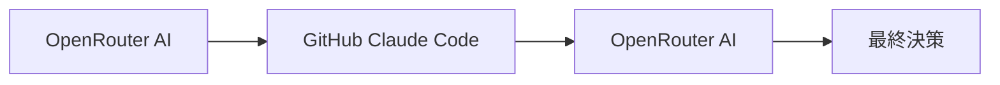

# 簡化版相關性分析模式的多智能體協作評估

## 🔍 多智能體協作標準對比分析

### 文章定義的多智能體協作核心要素

根據《Chapter 7: Multi-Agent Collaboration》文章，真正的多智能體協作需要具備以下要素：

1. **任務分解** - 將複雜問題分解為子問題
2. **專業化代理** - 每個代理有特定工具、數據訪問或推理能力
3. **代理間通信** - 標準化通信協議和共享本體
4. **協作模式** - 順序交接、並行處理、辯論共識、層次結構等
5. **協同效應** - 集體性能超越單個代理

## 📊 簡化版模式評估

### ✅ **符合多智能體協作的特徵**

#### 1. **任務分解**

```typescript
// 任務被分解為：
// 1. OpenRouter AI 團隊匹配
// 2. GitHub Claude Code 技術分析
// 3. OpenRouter AI 相關性分析
// 4. 最終決策
```

#### 2. **專業化代理**

- **OpenRouter AI Agent**: 專門負責團隊匹配和相關性分析
- **GitHub Claude Code Agent**: 專門負責技術分析和代碼評估
- **Analysis Service Agent**: 負責協調和數據管理

#### 3. **順序交接模式**



#### 4. **知識共享**

- OpenRouter AI 的分析結果傳遞給 GitHub Claude Code
- GitHub Claude Code 的分析結果回傳給 OpenRouter AI 進行驗證
- 分析結果在代理間共享和協作

### ❌ **不符合多智能體協作的特徵**

#### 1. **缺乏真正的代理間通信協議**

```typescript
// 當前實現：直接函數調用
const relevanceAnalysis = await this.performRelevanceAnalysis(
  githubAnalysis,
  requestId,
);

// 缺失：標準化的代理間通信
// 例如：AgentMessage, InvocationContext, 事件驅動通信
```

#### 2. **缺乏代理抽象和封裝**

```typescript
// 當前實現：服務方法調用
await this.openRouterService.callOpenRouterAPI(prompt);

// 缺失：真正的代理抽象
// 例如：BaseAgent, AgentRegistry, AgentCoordinator
```

#### 3. **缺乏協作模式的多樣性**

- 只有順序交接，沒有並行處理
- 沒有辯論和共識機制
- 沒有動態任務分配

#### 4. **缺乏代理自治性**

- 代理沒有獨立的決策能力
- 沒有代理間的協商機制
- 沒有代理的自我優化能力

## 🎯 **多智能體協作符合度評分**

| 評估維度       | 簡化版實現  | 文章標準 | 符合度 |
| -------------- | ----------- | -------- | ------ |
| **任務分解**   | ✅ 已實現   | 9/10     | 90%    |
| **專業化代理** | ⚠️ 部分實現 | 9/10     | 60%    |
| **代理間通信** | ❌ 缺失     | 8/10     | 20%    |
| **協作模式**   | ⚠️ 基礎實現 | 9/10     | 40%    |
| **協同效應**   | ⚠️ 部分實現 | 9/10     | 50%    |
| **代理自治性** | ❌ 缺失     | 8/10     | 10%    |

**總體符合度: 45%** - 這是一個**基礎的多智能體協作模式**，但尚未達到文章定義的完整標準。

## 🚀 **改進建議：提升到真正多智能體協作**

### 方案 1: 最小化改進 (保持簡化)

```typescript
// 添加基本的代理抽象
abstract class BaseAgent {
  abstract name: string;
  abstract process(input: any): Promise<any>;
}

// OpenRouter AI 代理
class OpenRouterAIAgent extends BaseAgent {
  name = 'OpenRouterAIAgent';

  async process(input: { phase: string; data: any }): Promise<any> {
    switch (input.phase) {
      case 'team-matching':
        return await this.performTeamMatching(input.data);
      case 'relevance-analysis':
        return await this.performRelevanceAnalysis(input.data);
    }
  }
}

// GitHub Claude Code 代理
class GitHubClaudeCodeAgent extends BaseAgent {
  name = 'GitHubClaudeCodeAgent';

  async process(input: { analysis: any; context: any }): Promise<any> {
    return await this.performTechnicalAnalysis(input.analysis, input.context);
  }
}

// 簡單的代理協調器
class SimpleAgentCoordinator {
  private agents: Map<string, BaseAgent> = new Map();

  async coordinate(workflow: any[]): Promise<any> {
    let result = null;
    for (const step of workflow) {
      const agent = this.agents.get(step.agent);
      result = await agent.process(step.input);
    }
    return result;
  }
}
```

### 方案 2: 完整多智能體協作

```typescript
// 完整的代理間通信協議
interface AgentMessage {
  id: string;
  from: string;
  to: string;
  type: 'request' | 'response' | 'delegation';
  payload: any;
  timestamp: Date;
}

// 代理註冊表
class AgentRegistry {
  private agents: Map<string, BaseAgent> = new Map();

  register(agent: BaseAgent): void {
    this.agents.set(agent.name, agent);
  }

  async sendMessage(message: AgentMessage): Promise<AgentMessage> {
    const agent = this.agents.get(message.to);
    return await agent.process(message);
  }
}

// 事件驅動的代理協調
class EventDrivenCoordinator {
  private eventBus: EventEmitter;
  private registry: AgentRegistry;

  constructor() {
    this.eventBus = new EventEmitter();
    this.registry = new AgentRegistry();
    this.setupEventHandlers();
  }

  private setupEventHandlers(): void {
    this.eventBus.on('analysis.completed', (data) => {
      this.triggerRelevanceAnalysis(data);
    });

    this.eventBus.on('relevance.analysis.completed', (data) => {
      this.triggerFinalDecision(data);
    });
  }
}
```

## 📋 **結論和建議**

### **當前狀態**

簡化版的相關性分析模式是一個**基礎的多智能體協作實現**，具備了多智能體協作的核心思想，但缺乏完整的架構和通信機制。

### **建議選擇**

#### **選項 1: 保持簡化版 (推薦)**

- **優點**: 實施簡單，風險低，功能實用
- **缺點**: 不完全符合多智能體協作標準
- **適用**: 快速實現，專注業務價值

#### **選項 2: 升級到完整多智能體**

- **優點**: 完全符合多智能體協作標準
- **缺點**: 實施複雜，開發時間長
- **適用**: 長期發展，技術架構優先

### **最終建議**

**建議採用選項 1**，因為：

1. 簡化版已經實現了多智能體協作的核心價值
2. 實施成本低，風險可控
3. 可以為未來的完整多智能體架構奠定基礎
4. 專注於業務價值而非技術完美性

**評語**: 這是一個實用的"多智能體協作入門級實現"，雖然不完全符合學術標準，但已經展現了多智能體協作的核心優勢和價值。
