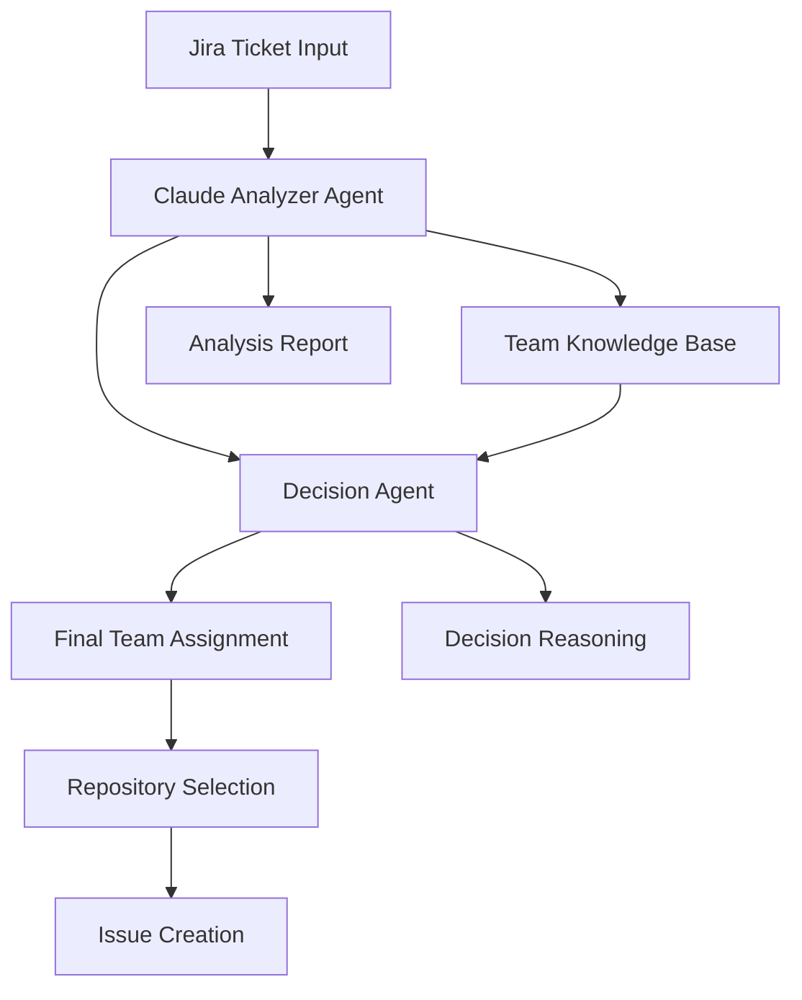

# Multi-Agent 架構規劃：智能團隊分配系統

## 📋 項目概述

將現有的 `smartMapTicketToTeam` 方法改造成基於 Claude AI 的 multi-agent 系統，實現更智能、更準確的 Jira ticket 到團隊的映射。

## 🎯 目標

- 使用 Claude AI 深度理解 ticket 內容
- 實現智能的團隊匹配算法
- 提供可解釋的決策過程
- 保持現有 API 兼容性
- 添加錯誤處理和回退機制

## 🏗️ 架構設計

### 整體架構流程



### Agent 角色定義

#### 1. Claude Analyzer Agent

**職責：**

- 深度分析 Jira ticket 內容
- 提取技術領域、業務需求、複雜度等關鍵信息
- 生成結構化的分析報告

**輸入：**

- Jira ticket summary
- Jira ticket description
- 可選的額外上下文信息

**輸出：**

```typescript
interface ClaudeAnalysisResult {
  technicalDomains: string[]; // 技術領域：['frontend', 'backend', 'mobile']
  businessAreas: string[]; // 業務領域：['user-management', 'payment']
  complexity: 'low' | 'medium' | 'high';
  urgency: 'low' | 'medium' | 'high';
  estimatedEffort: number; // 預估工作量（人天）
  keywords: string[]; // 提取的關鍵詞
  confidence: number; // 分析信心度 0-1
  reasoning: string; // 分析推理過程
}
```

#### 2. Decision Agent

**職責：**

- 基於 Claude 分析結果進行團隊匹配
- 結合團隊知識庫進行決策
- 提供決策解釋和置信度

**輸入：**

- Claude 分析結果
- 團隊知識庫配置
- 歷史分配記錄（可選）

**輸出：**

```typescript
interface DecisionResult {
  bestMatch: {
    team: string;
    owner: string;
    repo: string;
    score: number;
    confidence: number;
    reasoning: string;
  } | null;
  allTeamRepos: Array<{
    owner: string;
    repo: string;
    priority: number;
    score: number;
    reasoning: string;
  }>;
  alternatives: Array<{
    team: string;
    score: number;
    reasoning: string;
  }>;
}
```

## 📁 文件結構規劃

```
src/modules/analyze/
├── agents/
│   ├── claude-analyzer.agent.ts      # Claude 分析 Agent
│   ├── decision.agent.ts             # 決策 Agent
│   └── base.agent.ts                 # Agent 基類
├── dto/
│   ├── agent-analysis.dto.ts         # Agent 相關 DTO
│   └── team-knowledge.dto.ts         # 團隊知識庫 DTO
├── services/
│   ├── claude.service.ts             # Claude API 服務
│   └── team-knowledge.service.ts     # 團隊知識庫服務
├── config/
│   └── team-knowledge.config.ts      # 團隊配置
└── analyze.service.ts                # 主服務（整合所有 Agent）
```

## 🔧 實現計劃

### Phase 1: 基礎架構搭建

1. **創建 Agent 基類和接口**
   - 定義統一的 Agent 接口
   - 實現基礎的錯誤處理和日誌記錄
   - 添加配置管理

2. **實現 Claude 服務**
   - 集成 Claude API
   - 實現 prompt 模板管理
   - 添加重試機制和錯誤處理

3. **創建 DTO 定義**
   - 定義所有 Agent 的輸入輸出格式
   - 添加驗證規則
   - 創建類型安全的接口

### Phase 2: Agent 實現

1. **Claude Analyzer Agent**
   - 實現 ticket 內容分析邏輯
   - 設計 prompt 模板
   - 添加結果解析和驗證

2. **Decision Agent**
   - 實現團隊匹配算法
   - 集成團隊知識庫
   - 添加決策解釋生成

3. **團隊知識庫服務**
   - 擴展現有團隊配置
   - 添加動態配置支持
   - 實現配置驗證

### Phase 3: 整合和優化

1. **整合到 AnalyzeService**
   - 替換現有的 `smartMapTicketToTeam` 方法
   - 保持 API 兼容性
   - 添加回退機制

2. **錯誤處理和監控**
   - 實現完整的錯誤處理
   - 添加性能監控
   - 創建詳細的日誌記錄

3. **測試和驗證**
   - 單元測試
   - 集成測試
   - 性能測試

## 🎨 Claude Prompt 設計

### Claude Analyzer Agent Prompt

````markdown
你是一個專業的軟體開發需求分析師。請分析以下 Jira ticket 並提供結構化的分析結果。

## Ticket 信息

**標題：** {summary}
**描述：** {description}

## 分析要求

請從以下維度進行分析：

1. **技術領域識別**
   - 前端開發 (frontend)
   - 後端開發 (backend)
   - 移動端開發 (mobile)
   - 數據庫 (database)
   - 基礎設施 (infrastructure)
   - 其他 (other)

2. **業務領域識別**
   - 用戶管理 (user-management)
   - 支付系統 (payment)
   - 內容管理 (content-management)
   - 報告分析 (reporting)
   - 系統集成 (integration)
   - 其他 (other)

3. **複雜度評估**
   - 低 (low): 簡單功能，1-3天
   - 中 (medium): 中等功能，1-2週
   - 高 (high): 複雜功能，2週以上

4. **緊急程度**
   - 低 (low): 可以延後
   - 中 (medium): 正常優先級
   - 高 (high): 需要優先處理

## 輸出格式

請以 JSON 格式返回分析結果：

```json
{
  "technicalDomains": ["frontend", "backend"],
  "businessAreas": ["user-management"],
  "complexity": "medium",
  "urgency": "medium",
  "estimatedEffort": 5,
  "keywords": ["login", "authentication", "user"],
  "confidence": 0.85,
  "reasoning": "這是一個用戶登入功能需求，涉及前端界面和後端認證邏輯..."
}
```
````

````

### Decision Agent Prompt

```markdown
你是一個團隊分配專家。基於需求分析結果，為以下 ticket 選擇最適合的開發團隊。

## 需求分析結果
{claudeAnalysisResult}

## 可用團隊配置
{teamConfigurations}

## 分配標準
1. **技術匹配度** (40%): 團隊技術棧與需求匹配程度
2. **業務熟悉度** (30%): 團隊對相關業務領域的熟悉程度
3. **工作負載** (20%): 團隊當前工作負載情況
4. **歷史表現** (10%): 團隊處理類似需求的歷史表現

## 輸出格式
```json
{
  "bestMatch": {
    "team": "Desktop Team",
    "owner": "Positive-LLC",
    "repo": "ai-agent-dev",
    "score": 85,
    "confidence": 0.9,
    "reasoning": "該團隊在前端和後端開發方面都有豐富經驗..."
  },
  "allTeamRepos": [
    {
      "owner": "Positive-LLC",
      "repo": "ai-agent-dev",
      "priority": 1,
      "score": 85,
      "reasoning": "主要匹配理由..."
    }
  ],
  "alternatives": [
    {
      "team": "Mobile Team",
      "score": 65,
      "reasoning": "雖然有移動端經驗，但主要需求是桌面端..."
    }
  ]
}
````

```

## 🔄 遷移策略

### 階段性遷移
1. **第一階段**: 並行運行新舊系統，記錄結果差異
2. **第二階段**: 逐步切換到新系統，保留舊系統作為回退
3. **第三階段**: 完全切換到新系統，移除舊代碼

### 兼容性保證
- 保持現有 API 接口不變
- 返回格式保持一致
- 添加新的可選參數支持

## 📊 監控和指標

### 關鍵指標
- **準確率**: 分配結果的準確性
- **響應時間**: Agent 處理時間
- **置信度**: 決策的置信度分佈
- **錯誤率**: 系統錯誤和回退使用率

### 日誌記錄
- Agent 執行過程
- 決策推理過程
- 錯誤和異常情況
- 性能指標

## 🚀 未來擴展

### 短期擴展
- 支持更多團隊配置
- 添加學習機制
- 實現 A/B 測試

### 長期願景
- 自動化團隊配置優化
- 集成更多外部數據源
- 實現預測性分配

## 📝 實施時間表

| 階段 | 任務 | 預計時間 | 負責人 |
|------|------|----------|--------|
| Phase 1 | 基礎架構搭建 | 3-5天 | 開發團隊 |
| Phase 2 | Agent 實現 | 5-7天 | 開發團隊 |
| Phase 3 | 整合和優化 | 3-4天 | 開發團隊 |
| 測試 | 測試和驗證 | 2-3天 | QA 團隊 |
| 部署 | 生產部署 | 1-2天 | DevOps 團隊 |

**總計：14-21天**

## 🔍 風險評估

### 技術風險
- Claude API 可用性和延遲
- 複雜 prompt 的穩定性
- 系統性能影響

### 業務風險
- 分配準確性下降
- 用戶接受度問題
- 回退機制失效

### 緩解措施
- 實現多層回退機制
- 添加詳細監控和告警
- 準備快速回滾方案
```
