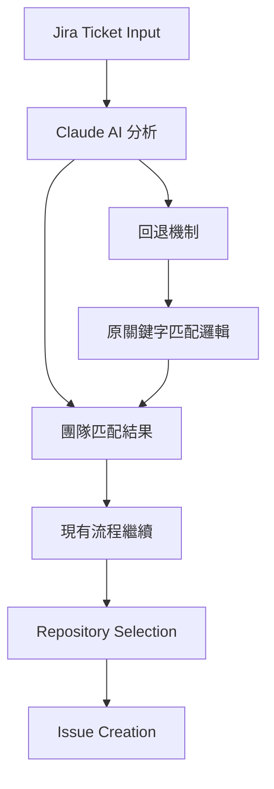

# AI 智能團隊分配規劃：簡化版

## 📋 項目概述

將現有的 `smartMapTicketToTeam` 方法的核心邏輯抽出來交給 Claude AI 判斷，保持其他流程機制不變，實現更智能的 Jira ticket 到團隊的映射。

## 🎯 目標

- 將 `smartMapTicketToTeam` 的關鍵字匹配邏輯替換為 AI 分析
- 保持現有的返回格式和後續流程不變
- 提供更準確的團隊匹配結果
- 添加錯誤處理和回退到原邏輯的機制

## 🏗️ 簡化架構設計

### 核心改動點



### 核心邏輯替換

**現有邏輯：**

```typescript
// 現有的關鍵字匹配邏輯
for (const teamInfo of this.teamMapping) {
  for (const keywordInfo of teamInfo.keywords) {
    if (summaryLower.includes(keywordInfo.keyword)) {
      // 計算分數和匹配
    }
  }
}
```

**新的 AI 邏輯：**

```typescript
// 使用 Claude AI 進行智能分析
const aiAnalysis = await this.claudeService.analyzeTicket(
  ticketSummary,
  ticketDescription,
);
const teamMatch = this.convertAIToTeamMapping(aiAnalysis);
```

### 保持不變的部分

- `smartMapTicketToTeam` 方法的輸入輸出格式
- 返回的 `bestMatch` 和 `allTeamRepos` 結構
- 後續的 issue 創建流程
- 現有的團隊配置 `teamMapping`

## 📁 簡化文件結構

```
src/modules/analyze/
├── services/
│   └── claude.service.ts             # Claude API 服務（新增）
├── dto/
│   └── claude-analysis.dto.ts        # Claude 分析結果 DTO（新增）
└── analyze.service.ts                # 主服務（修改 smartMapTicketToTeam 方法）
```

### 新增文件說明

1. **claude.service.ts** - 負責與 Claude API 交互
2. **claude-analysis.dto.ts** - 定義 Claude 分析結果的數據結構

## 🔧 簡化實現計劃

### Phase 1: 創建 Claude 服務（1-2天）

1. **創建 Claude 服務**
   - 實現 Claude API 集成
   - 設計團隊匹配的 prompt
   - 添加錯誤處理和重試機制

2. **創建 DTO 定義**
   - 定義 Claude 分析結果的數據結構
   - 添加驗證規則

### Phase 2: 修改 smartMapTicketToTeam（1天）

1. **替換核心邏輯**
   - 將關鍵字匹配邏輯替換為 AI 分析
   - 保持現有的返回格式
   - 添加回退到原邏輯的機制

2. **測試和驗證**
   - 確保返回格式一致
   - 測試回退機制
   - 驗證後續流程正常

## 🎨 簡化 Claude Prompt 設計

### 團隊匹配 Prompt

````markdown
你是一個團隊分配專家。請分析以下 Jira ticket 並選擇最適合的開發團隊。

## Ticket 信息

**標題：** {summary}
**描述：** {description}

## 可用團隊配置

{teamConfigurations}

## 分析要求

請根據 ticket 內容，從以下團隊中選擇最適合的：

1. **Desktop Team** - 負責桌面應用、PC/Mac 軟體開發
   - 關鍵字：desktop, pc, windows, mac, application, client
   - 儲存庫：Positive-LLC/ai-agent-dev, Positive-LLC/jira-analyze-dev

## 輸出格式

請以 JSON 格式返回分析結果：

```json
{
  "bestMatch": {
    "team": "Desktop Team",
    "owner": "Positive-LLC",
    "repo": "ai-agent-dev",
    "score": 85,
    "confidence": 0.9,
    "reasoning": "這個需求涉及桌面應用開發，Desktop Team 最適合..."
  },
  "allTeamRepos": [
    {
      "owner": "Positive-LLC",
      "repo": "ai-agent-dev",
      "priority": 1,
      "score": 85,
      "reasoning": "主要匹配理由..."
    },
    {
      "owner": "Positive-LLC",
      "repo": "jira-analyze-dev",
      "priority": 2,
      "score": 70,
      "reasoning": "次要匹配理由..."
    }
  ]
}
```
````

**注意：**

- 如果沒有明顯匹配的團隊，請返回 null
- 分數範圍：0-100
- 信心度範圍：0-1
- 必須提供詳細的推理過程

````

## 🔄 簡化遷移策略

### 直接替換 + 回退機制
1. **直接替換**: 將 `smartMapTicketToTeam` 的核心邏輯替換為 AI 分析
2. **回退機制**: 如果 AI 分析失敗，自動回退到原有的關鍵字匹配邏輯
3. **無縫切換**: 保持現有 API 和返回格式完全不變

### 兼容性保證
- 保持現有 API 接口完全不變
- 返回格式完全一致
- 後續流程無需任何修改

## 📊 簡化監控

### 關鍵指標
- **AI 分析成功率**: AI 分析成功的比例
- **回退使用率**: 回退到原邏輯的比例
- **響應時間**: AI 分析的處理時間
- **分配準確性**: 團隊分配的準確程度

### 日誌記錄
- AI 分析結果和推理過程
- 回退觸發的原因
- 錯誤和異常情況

## 📝 簡化實施時間表

| 階段 | 任務 | 預計時間 |
|------|------|----------|
| Phase 1 | 創建 Claude 服務和 DTO | 1-2天 |
| Phase 2 | 修改 smartMapTicketToTeam | 1天 |
| 測試 | 測試和驗證 | 0.5天 |

**總計：2.5-3.5天**

## 🔍 簡化風險評估

### 主要風險
- Claude API 可用性和延遲
- AI 分析結果不穩定

### 緩解措施
- 實現自動回退機制
- 添加超時處理
- 保留原有邏輯作為備用

## 💡 核心實現思路

### 修改 smartMapTicketToTeam 方法

```typescript
async smartMapTicketToTeam(ticketSummary: string): Promise<{
  bestMatch: { owner: string; repo: string; team: string; matchedKeywords: string[]; score: number } | null;
  allTeamRepos: { owner: string; repo: string; priority: number }[];
  team: string | null;
}> {
  try {
    // 1. 嘗試使用 AI 分析
    const aiResult = await this.claudeService.analyzeTeamMatch(ticketSummary, this.teamMapping);

    if (aiResult && aiResult.bestMatch) {
      this.logger.log(`[Info] AI 分析成功: ${aiResult.bestMatch.team}`);
      return {
        bestMatch: {
          owner: aiResult.bestMatch.owner,
          repo: aiResult.bestMatch.repo,
          team: aiResult.bestMatch.team,
          matchedKeywords: ['ai-analyzed'],
          score: aiResult.bestMatch.score
        },
        allTeamRepos: aiResult.allTeamRepos,
        team: aiResult.bestMatch.team
      };
    }
  } catch (error) {
    this.logger.warn(`[Warning] AI 分析失敗，回退到原邏輯: ${error.message}`);
  }

  // 2. 回退到原有的關鍵字匹配邏輯
  return this.originalSmartMapTicketToTeam(ticketSummary);
}

// 保留原有的邏輯作為回退
private originalSmartMapTicketToTeam(ticketSummary: string) {
  // 現有的關鍵字匹配邏輯...
}
````

### 新增 Claude 服務

```typescript
@Injectable()
export class ClaudeService {
  async analyzeTeamMatch(
    ticketSummary: string,
    teamMapping: any[],
  ): Promise<any> {
    // 調用 Claude API 進行分析
    // 返回與現有格式兼容的結果
  }
}
```

這樣的設計確保了：

1. **最小改動**: 只修改一個方法的核心邏輯
2. **完全兼容**: 返回格式與現有代碼完全一致
3. **安全回退**: AI 失敗時自動使用原邏輯
4. **快速實施**: 預計 2-3 天即可完成
