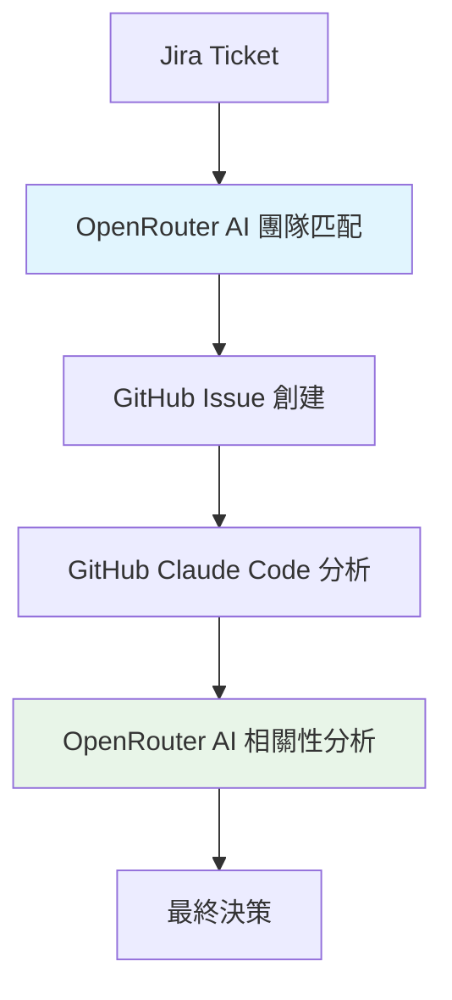

# 簡化版：OpenRouter AI 相關性分析機制

## 🎯 簡化目標

**核心功能**: OpenRouter AI 對 GitHub Claude Code 的分析結果進行相關性分析，判斷分析結果與原始需求的匹配度。

## 🔄 簡化流程



## 🚀 實現方案

### 1. 增強現有的 `getAnalysisResult` 方法

```typescript
// 在 analyze.service.ts 中修改
async getAnalysisResult(analysisRequest: AnalysisResultFromClaudeDto): Promise<ExtractedAnalysisResultDto> {
  const issueUrl = analysisRequest.issue_url;
  const issue = await this.githubService.getIssueByUrl(issueUrl);
  const requestId = this.getRequestIdFromBody(issue?.body || '');

  // 提取 GitHub Claude Code 的分析結果
  const githubAnalysis = this.extractGitHubAnalysis(analysisRequest.result);

  // 使用 OpenRouter AI 進行相關性分析
  const relevanceAnalysis = await this.performRelevanceAnalysis(
    githubAnalysis,
    requestId
  );

  // 更新分析結果
  const findAnalysisRequest = await this.analysisRequestRepository.findOne({
    where: { requestId },
  });

  if (findAnalysisRequest) {
    const findRepo = findAnalysisRequest.analysisResults.find(
      result => result.repository === analysisRequest.repository
    );
    if (findRepo) {
      // 使用 OpenRouter AI 的相關性分析結果
      findRepo.result = relevanceAnalysis.finalScore;
      findRepo.relevanceAnalysis = relevanceAnalysis; // 新增字段
    }
    await this.analysisRequestRepository.save(findAnalysisRequest);
  }

  const checkAllResult = findAnalysisRequest?.analysisResults.every(result => result.result !== '');
  if (checkAllResult && findAnalysisRequest) {
    await this.evaluateAndCloseLowScoreIssues(findAnalysisRequest);
  }

  return {
    repository: analysisRequest.repository,
    issue_number: analysisRequest.issue_number,
    relevanceScore: relevanceAnalysis.finalScore,
    relatedFiles: githubAnalysis.relatedFiles,
    issue_url: `https://github.com/${analysisRequest.repository}/issues/${analysisRequest.issue_number}`,
    relevanceAnalysis: relevanceAnalysis, // 新增相關性分析結果
  };
}
```

### 2. 新增相關性分析方法

````typescript
/**
 * 使用 OpenRouter AI 對 GitHub Claude Code 的分析結果進行相關性分析
 */
private async performRelevanceAnalysis(
  githubAnalysis: any,
  requestId: string
): Promise<RelevanceAnalysisResult> {
  try {
    // 獲取原始 Jira ticket 信息
    const analysisRequest = await this.analysisRequestRepository.findOne({
      where: { requestId },
    });

    if (!analysisRequest) {
      throw new Error(`Analysis request not found: ${requestId}`);
    }

    // 構建相關性分析 prompt
    const relevancePrompt = this.buildRelevanceAnalysisPrompt(
      analysisRequest.jiraTicketContext,
      githubAnalysis
    );

    // 調用 OpenRouter AI 進行相關性分析
    const response = await this.openRouterService.callOpenRouterAPI(relevancePrompt);
    const relevanceResult = this.parseRelevanceAnalysisResponse(response);

    this.logger.log(`[Info] OpenRouter AI 相關性分析完成: ${relevanceResult.finalScore}分`);

    return relevanceResult;
  } catch (error) {
    this.logger.error(`[Error] OpenRouter AI 相關性分析失敗:`, error);

    // 回退到原有的提取邏輯
    const extractedData = this.extractRelevanceData(githubAnalysis.rawResult);
    return {
      finalScore: parseInt(extractedData.relevanceScore) || 0,
      confidence: 0.5,
      reasoning: '回退到原有邏輯',
      analysisDetails: {
        originalScore: extractedData.relevanceScore,
        relatedFiles: extractedData.relatedFiles,
      }
    };
  }
}

/**
 * 構建相關性分析的 prompt
 */
private buildRelevanceAnalysisPrompt(
  jiraTicket: any,
  githubAnalysis: any
): string {
  return `你是一個相關性分析專家。請分析以下 GitHub Claude Code 的分析結果與原始 Jira ticket 的相關性。

## 原始 Jira Ticket
**標題**: ${jiraTicket.summary}
**描述**: ${jiraTicket.description}
**Key**: ${jiraTicket.key}

## GitHub Claude Code 分析結果
**分析內容**: ${githubAnalysis.analysis}
**原始評分**: ${githubAnalysis.score}分
**相關文件**: ${githubAnalysis.relatedFiles?.join(', ') || '無'}

## 相關性分析要求
請從以下維度分析 GitHub Claude Code 的分析結果與原始需求的相關性：

1. **需求理解準確性** (25分): GitHub Claude Code 是否正確理解了原始需求
2. **技術分析深度** (25分): 技術分析的深度和準確性
3. **架構匹配度** (25分): 分析結果與團隊架構的匹配程度
4. **實用性評估** (25分): 分析結果的實用性和可操作性

## 輸出格式
請以 JSON 格式返回相關性分析結果：

\`\`\`json
{
  "finalScore": 85,
  "confidence": 0.9,
  "reasoning": "GitHub Claude Code 的分析準確理解了需求，技術分析深入且實用...",
  "analysisDetails": {
    "requirementUnderstanding": {
      "score": 22,
      "comment": "準確理解了桌面應用的需求"
    },
    "technicalAnalysis": {
      "score": 23,
      "comment": "技術分析深入，涵蓋了關鍵技術點"
    },
    "architectureMatch": {
      "score": 20,
      "comment": "與 Desktop Team 架構匹配良好"
    },
    "practicality": {
      "score": 20,
      "comment": "分析結果具有很好的實用性"
    }
  },
  "improvements": [
    "建議添加更多技術細節",
    "可以考慮跨平台兼容性"
  ],
  "recommendations": {
    "acceptAnalysis": true,
    "confidence": "high",
    "nextSteps": ["開始開發", "進一步技術調研"]
  }
}
\`\`\`

**注意**:
- 最終評分範圍：0-100
- 信心度範圍：0-1
- 必須提供詳細的推理過程
- 只返回 JSON，不要包含其他文字`;
}

/**
 * 解析相關性分析回應
 */
private parseRelevanceAnalysisResponse(response: string): RelevanceAnalysisResult {
  try {
    let jsonStr = response.trim();

    // 嘗試提取 JSON 代碼塊中的內容
    const jsonMatch = response.match(/```json\s*([\s\S]*?)\s*```/);
    if (jsonMatch) {
      jsonStr = jsonMatch[1].trim();
    }

    const parsed = JSON.parse(jsonStr);

    // 驗證必要字段
    if (typeof parsed.finalScore !== 'number' || parsed.finalScore < 0 || parsed.finalScore > 100) {
      throw new Error('Invalid finalScore');
    }

    return {
      finalScore: parsed.finalScore,
      confidence: parsed.confidence || 0.8,
      reasoning: parsed.reasoning || '相關性分析完成',
      analysisDetails: parsed.analysisDetails || {},
      improvements: parsed.improvements || [],
      recommendations: parsed.recommendations || {}
    };
  } catch (error) {
    this.logger.error(`[Error] 解析相關性分析回應失敗:`, error);
    this.logger.error(`[Error] 原始回應內容: ${response}`);

    // 回退處理
    return {
      finalScore: 50,
      confidence: 0.5,
      reasoning: '解析失敗，使用默認評分',
      analysisDetails: {},
      improvements: [],
      recommendations: {}
    };
  }
}
````

### 3. 新增相關性分析結果類型

```typescript
// 在 dto 文件中新增
export interface RelevanceAnalysisResult {
  finalScore: number;
  confidence: number;
  reasoning: string;
  analysisDetails: {
    requirementUnderstanding?: {
      score: number;
      comment: string;
    };
    technicalAnalysis?: {
      score: number;
      comment: string;
    };
    architectureMatch?: {
      score: number;
      comment: string;
    };
    practicality?: {
      score: number;
      comment: string;
    };
  };
  improvements: string[];
  recommendations: {
    acceptAnalysis: boolean;
    confidence: 'low' | 'medium' | 'high';
    nextSteps: string[];
  };
}

export interface ExtractedAnalysisResultDto {
  repository: string;
  issue_number: number;
  relevanceScore: string;
  relatedFiles: string[];
  issue_url: string;
  relevanceAnalysis?: RelevanceAnalysisResult; // 新增字段
}
```

### 4. 修改 OpenRouter 服務以支援相關性分析

```typescript
// 在 openrouter.service.ts 中新增
/**
 * 調用 OpenRouter API 進行相關性分析
 */
async performRelevanceAnalysis(prompt: string): Promise<string | null> {
  try {
    this.logger.log(`[Info] 開始 OpenRouter AI 相關性分析`);

    const response = await this.callOpenRouterAPI(prompt);

    if (!response) {
      this.logger.warn(`[Warning] OpenRouter API 返回空結果`);
      return null;
    }

    this.logger.log(`[Info] OpenRouter AI 相關性分析成功`);
    return response;
  } catch (error) {
    this.logger.error(`[Error] OpenRouter AI 相關性分析失敗:`, error);
    throw error;
  }
}
```

## 📊 實施優勢

### **簡化優勢**

1. **最小改動**: 只需修改現有的 `getAnalysisResult` 方法
2. **保持兼容**: 不影響現有的工作流程
3. **專注功能**: 專注於相關性分析，避免過度複雜化

### **功能優勢**

1. **智能驗證**: OpenRouter AI 驗證 GitHub Claude Code 的分析質量
2. **多維度評估**: 從需求理解、技術分析、架構匹配、實用性四個維度評估
3. **改進建議**: 提供具體的改進建議和下一步行動
4. **信心度評估**: 提供分析結果的信心度評估

## 🔧 實施步驟

### **步驟 1: 修改現有方法 (1天)**

- 修改 `getAnalysisResult` 方法
- 新增 `performRelevanceAnalysis` 方法
- 新增相關的 DTO 類型

### **步驟 2: 測試和優化 (1-2天)**

- 測試相關性分析功能
- 優化 prompt 設計
- 完善錯誤處理

### **步驟 3: 部署和監控 (0.5天)**

- 部署到測試環境
- 監控分析結果質量
- 收集反饋並優化

## 📈 預期效果

- **分析準確率提升**: 通過 OpenRouter AI 驗證，提升分析結果的準確性
- **決策信心度提升**: 多維度評估提供更高的決策信心度
- **改進建議**: 提供具體的改進建議，幫助團隊持續優化
- **最小實施成本**: 只需 2-3 天即可完成實施

這個簡化方案專注於核心功能，讓 OpenRouter AI 對 GitHub Claude Code 的分析結果進行智能的相關性分析，既保持了系統的簡潔性，又提供了有價值的協作功能。
